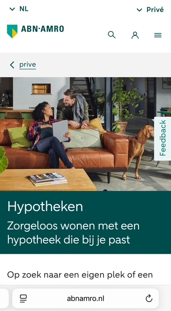
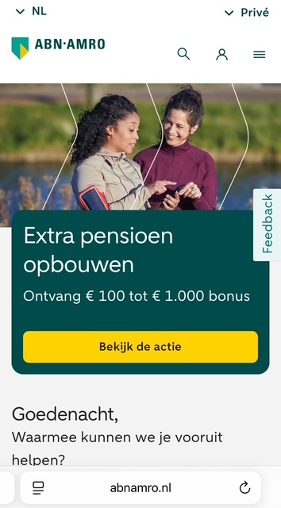
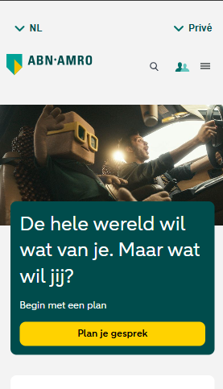
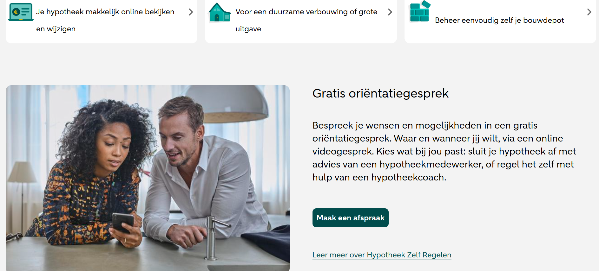
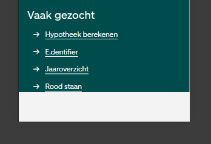

# Procesverslag
Markdown is een simpele manier om HTML te schrijven.  
Markdown cheat cheet: [Hulp bij het schrijven van Markdown](https://github.com/adam-p/markdown-here/wiki/Markdown-Cheatsheet).

Nb. De standaardstructuur en de spartaanse opmaak van de README.md zijn helemaal prima. Het gaat om de inhoud van je procesverslag. Besteedt de tijd voor pracht en praal aan je website.

Nb. Door *open* toe te voegen aan een *details* element kun je deze standaard open zetten. Fijn om dat steeds voor de relevante stuk(ken) te doen.

## Jij

  
uitwerken voor kick-off werkgroep

  ### Auteur:
  Ilias Khamal

  #### Je startniveau:
  Rood

  #### Je focus:
  Responsiveness
 

## Je website

  
uitwerken voor kick-off werkgroep

  ### Je opdracht:
  wwww.abnamro.nl

  #### Screenshot(s) van de eerste pagina (small screen): 
  Home
  

  #### Screenshot(s) van de tweede pagina (small screen):
  Hypotheken
  
 

## Toegankelijkheidstest 1/2 (week 1)

  
uitwerken na test in 2e werkgroep

  ### Bevindingen
  Lijst met je bevindingen die in de test naar voren kwamen:

  -Site heeft geen darkmode, erg opmerkelijk want het is de website van een van de grootste banken van Nederland

  -Geen media (audio of video) op de pagina's

  -Super responsive

  -Weinig alts op foto's 

  -Geen custom ::selection

## Breakdownschets (week 1)

  
uitwerken na afloop 3e werkgroep

  ### de hele pagina: 
  

  ### dynamisch deel (bijv menu): 
  

  ### wellicht nog een dynamisch deel (bijv filter): 
  

## Voortgang 1 (week 2)

  
uitwerken voor 1e voortgang

  ### Stand van zaken
  hier dit ging goed & dit was lastig (neem ook screenshots op van delen van je website en code)

  ### Agenda voor meeting
  samen met je groepje opstellen

  | Beyzanur       | Quinten            | Quincy       | Zakaria          | Ilias|
  | ---            | ---                | ---          | ---              | Algemene feedback HTML|
  | Navigatie menu | Image achter tekst | Volgorde Html| en dan ik dat    | Wanner wel/geen section|
  |                | Carousel           | Inspringen   | dit wil ik zeker |
  | ...            | List aanspreken    | ...          | ...              |

  ### Verslag van meeting
  hier na afloop snel de uitkomsten van de meeting vastleggen

  - Mijn html zag er netjes uit
  - weet nu wanneer het gepast is sections te gebruiken en wanneer andere containers

## Voortgang 2 (week 3)

  
uitwerken voor 2e voortgang

  ### Stand van zaken
  hier dit ging goed & dit was lastig (neem ook screenshots op van delen van je website en code)

  ### Agenda voor meeting
  samen met je groepje opstellen

  | Quinten                        | Quincy             | Beyzanur                    | Zakaria          |
  | ---                            | ---                | ---                         | ---              |
  |Hero zorgt voor                 | sticky nav werkt   | Moeite met lijst stylen     | Flexbox moeite   |
  | x-scroll                       | niet| nog een punt | en hamburger menu           |                  |
  |Grid lukt niet met ul/li        | ...                | ...                         | ...              |

Ilias:
Moeite met image resizen

  ### Verslag van meeting
  hier na afloop snel de uitkomsten van de meeting vastleggen

  - image resizen had alleen object-fit: cover; nodig

## Toegankelijkheidstest 2/2 (week 4)

  
uitwerken na test in 9e werkgroep

  ### Bevindingen
  Lijst met je bevindingen die in de test naar voren kwamen (geef ook aan wat er verbeterd is):
- moet nog erg werken aan responsiveness
- wel darkmode die de originele website niet heeft
- focus volgorde werkt
- screenreader werkt

## Voortgang 3 (week 4)

  
uitwerken voor 3e voortgang

  ### Stand van zaken
  hier dit ging goed & dit was lastig (neem ook screenshots op van delen van je website en code)

  ### Agenda voor meeting
  samen met je groepje opstellen

  | Beyzanur       | Quincy                 | Quinten           | Ilias            |
  | ---            | ---                    | ---               | ---              |
  | Hamburger menu | achtergrond veranderen | lukt niet om 2e   | Wanneer divs te  |
  | Pagina 0 margin| bij scrollen           | ul aan te spreken | gebruiken?       |
  | ...            | ...                    | ...               | ...              |

  ### Verslag van meeting
  hier na afloop snel de uitkomsten van de meeting vastleggen

  nooit divs gebruiken !!! (behalve soms)

## Eindgesprek (week 5)

  
uitwerken voor eindgesprek

  ### Je uitkomst - karakteristiek screenshots:
  

  ### Dit ging goed/Heb ik geleerd: 
  Ik heb immens veel geleerd over positioneren en layouts met grid en flexbox, 
  ik denk dat ik oprecht voor dit vak misschien 15% de hoeveelheid kennis hierover
  had ten opzichte van nu, vooral grid want die kende ik eigenlijk helemaal niet maar
  die heeft wel mijn voorkeur over flex vooral voor complexere layouts. Heb ook
  super veel geleerd over toegankelijkheid en responsiveness, het was interessant
  om te werken met de @media queries waarvan ik ook eerst niet wist dat ze bestonden.

  De kennis die ik heb op gedaan bij dit vak heeft me gemotiveerd om een nieuwe
  verbeterde versie van mijn portfolio website te maken met de kennis die ik nu heb.
  Ik ben trots op mezelf dat ik in een redelijk korte tijd zo veel dingen heb kunnen
  leren en ook gelijk kunnen gebruiken.

  

  ### Dit was lastig/Is niet gelukt:
  Javascript is wel mijn zwaktepunt heb ik gemerkt. Daarnaast was ik in tijdsnood gekomen waardoor
  ik bijvoorbeeld niet alle menu's heb kunnen uitwerken en er ook nog wat layout/styling foutjes
  zijn waardoor de site niet 1:1 overeenkomt met de originele abn site.

  

## Bronnenlijst

  
continu bijhouden terwijl je werkt

  Nb. Wees specifiek ('css-tricks' als bron is bijv. niet specifiek genoeg). 
  Nb. ChatGpT en andere AI horen er ook bij.
  Nb. Vermeld de bronnen ook in je code.

  1. ChatGPT voor een stukje code om te helpen met viewport width
  2. Mats Groot voor javascript
  3. ChatGPT en MDN voor algemene raadpleging maar niet gekopiëerd
  4. the a11y project voor visually hidden h1

Over het algemeen niet super veel bronnen gebruikt... wel vaker ChatGPT geraadpleegd maar dat was dan om 
te begrijpen hoe dingen werken en niet om letterlijk code te kopiëren en te plakken. Heb van een medestuden
(Mats Groot) hulp gekregen met de JavaScript want dat is niet mijn sterkste kant.

